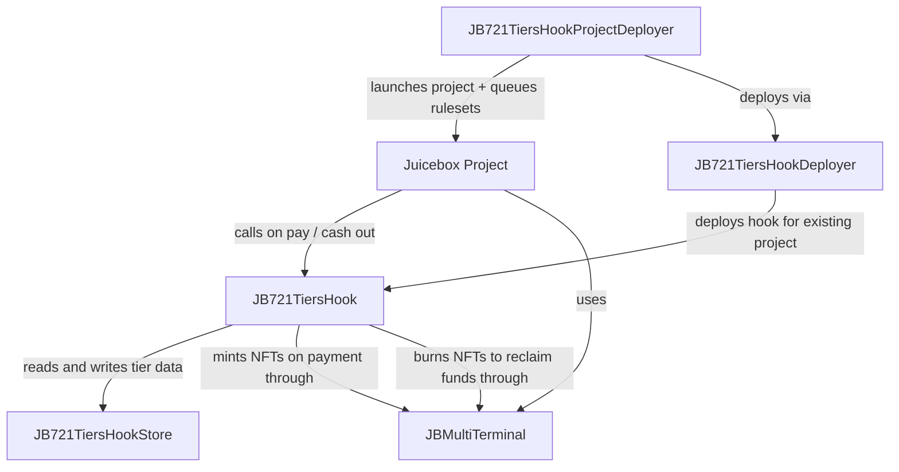

# Juicebox 721 Hook

Juicebox projects accept payments through terminals, but by default those payments only mint fungible project tokens. `nana-721-hook-v6` extends that flow with a tiered NFT system: project owners define tiers -- each with a price, supply cap, artwork, and optional per-tier features like reserve minting, voting power, discount schedules, and split-based fund routing -- and when someone pays the project, the hook mints the corresponding NFTs. Optionally, holders can burn their NFTs to reclaim funds from the project in proportion to each NFT's price relative to all outstanding NFTs.

_If you're having trouble understanding this contract, take a look at the [core protocol contracts](https://github.com/Bananapus/nana-core-v6) and the [documentation](https://docs.juicebox.money/) first. If you have questions, reach out on [Discord](https://discord.com/invite/ErQYmth4dS)._

## Conceptual Overview

### How it works

A `JB721TiersHook` is simultaneously a **data hook**, a **pay hook**, and a **cash out hook**. When a project using this hook is paid through a Juicebox terminal, the terminal asks the data hook what should happen. The data hook inspects the payment amount and any tier IDs the payer specified in the payment metadata, then returns instructions for the pay hook to mint the appropriate NFTs.

1. **Payment arrives** at the terminal. The terminal calls the data hook with details about the payment.
2. **Tier selection.** The payer can specify which tier IDs to mint in the payment metadata. If no tiers are specified and the hook allows credits, the payment amount is stored as NFT credits for future purchases.
3. **Price check.** Each requested tier's price (after any discount) is checked against the payment amount. If the tier and payment use different currencies, the hook's immutable `PRICES` contract converts between them. If `PRICES` is the zero address and currencies differ, the payment is silently ignored (no mint, no revert).
4. **Minting.** The pay hook mints one NFT per requested tier to the payment beneficiary, decrementing each tier's remaining supply.
5. **Reserve minting.** If a tier has a `reserveFrequency` of N, one extra NFT is minted to the tier's `reserveBeneficiary` for every N NFTs purchased. Reserve NFTs are minted lazily via `mintPendingReservesFor`.
6. **Credits.** Any leftover payment amount (the portion not spent on tier prices) is stored as NFT credits on the payer's address, redeemable toward future NFT purchases. Credits are only combined with the payment when `payer == beneficiary`. The hook can reject leftover funds entirely via the `preventOverspending` flag.
7. **Cash outs.** If the project owner enables `useDataHookForCashOut` in the ruleset metadata, NFT holders can burn their NFTs to reclaim funds. The reclaim amount is proportional to the NFT's original tier price (not the discounted price) relative to the total price of all outstanding NFTs (including pending reserves in the denominator). When NFT cash outs are enabled, fungible token cash outs are disabled -- attempting to cash out fungible tokens when the data hook is active will revert.

### Tier properties

Each tier is configured with a `JB721TierConfig` and stored compactly as a `JBStored721Tier`. Key properties:

- **Price** (`uint104`). The cost to mint one NFT from this tier, denominated in the currency specified in the hook's `JB721InitTiersConfig`.
- **Initial supply** (`uint32`). The maximum number of NFTs that can ever be minted from this tier (up to 999,999,999).
- **Category** (`uint24`). Groups tiers for organizational and access purposes. Tiers must be sorted by category in ascending order when added -- the store reverts with `JB721TiersHookStore_InvalidCategorySortOrder` otherwise.
- **Discount percent** (`uint8`). Reduces the effective purchase price. The denominator is 200, so a `discountPercent` of 100 means 50% off and 200 means free. Can be changed later via `setDiscountPercentOf`. Tiers configured with `cannotIncreaseDiscountPercent` only allow discounts to decrease. Cash out weight always uses the original tier price, not the discounted price.
- **Reserve frequency** (`uint16`). With a value of N, one extra NFT is minted to the `reserveBeneficiary` for every N NFTs purchased. Tiers with `allowOwnerMint` enabled cannot have reserves.
- **Voting units** (`uint104`). By default, each NFT's voting power equals its tier price. When `useVotingUnits` is true, a custom `votingUnits` value is used instead. Voting power is computed per-address across all tiers.
- **Split percent** (`uint32`). Routes a percentage of the tier's mint price to configured split recipients each time an NFT from the tier is purchased, out of `JBConstants.SPLITS_TOTAL_PERCENT` (1,000,000,000). The remaining funds stay in the project's balance. Split recipients follow the same priority as `JBMultiTerminal`: `split.hook` (receives funds via `IJBSplitHook.processSplitWith`) > `split.projectId` (routed via the project's primary terminal) > `split.beneficiary` (direct transfer).
- **Weight adjustment.** When splits are active, the hook adjusts the returned weight so the terminal only mints fungible project tokens proportional to the amount that actually enters the project treasury. For example, a 50% `splitPercent` on a 1 ETH payment results in half the normal token issuance. This weight adjustment can be disabled with the `issueTokensForSplits` flag, which gives payers full token credit regardless of where the funds go.
- **Flags.** `allowOwnerMint` (project owner can mint on-demand), `transfersPausable` (transfers can be paused per-ruleset), `cannotBeRemoved` (tier is permanent once added), `cannotIncreaseDiscountPercent` (discount can only decrease).
- **Token URI.** Each tier has an `encodedIPFSUri` for artwork/metadata, which can be overridden by an `IJB721TokenUriResolver`. The resolver can return unique values for each NFT within a tier.

### Per-ruleset options

The hook packs two boolean flags into the ruleset's `metadata` field via `JB721TiersRulesetMetadata`:

- `pauseTransfers` -- prevents all NFT transfers during this ruleset (only affects tiers with `transfersPausable` set).
- `pauseMintPendingReserves` -- prevents minting pending reserve NFTs during this ruleset.

### Operating envelope

The contract supports up to 65,535 tiers (`uint16.max`), but the practical operating envelope is much smaller because several important read paths iterate the tier set:

- **Up to ~100 active tiers**: comfortable for projects that expect frequent `balanceOf` reads, governance queries, or NFT cash outs.
- **100--200 tiers**: an advanced configuration requiring deliberate gas budgeting and frontend/operator awareness.
- **Above 200 tiers**: on-chain reads and cash-out accounting remain functionally correct, but gas costs scale linearly with `maxTierId`.

The test suite proves survivability at 100 and 200 tiers, and demonstrates that `balanceOf` and `totalCashOutWeight` become materially more expensive at 100 tiers than at 10. Treat this evidence as a scope boundary, not encouragement to target the theoretical ceiling.

## Architecture



| Contract | Lines | Description |
| --- | --- | --- |
| `JB721TiersHook` | 794 | The core tiered NFT hook. Implements pay hook (mint NFTs), cash out hook (burn NFTs for reclaim), and data hook (compute weight adjustments and split routing). Manages credits, tier adjustments, reserve minting, discount changes, and metadata. Inherits `JB721Hook` and `JBOwnable`. |
| `JB721TiersHookStore` | 1,240 | Shared data store for all `JB721TiersHook` instances. Manages tier storage (packed `JBStored721Tier`), supply tracking, bitmap-based tier removal, token ID encoding/decoding, and enforces tier sort order, supply limits, and flag constraints. |
| `JB721TiersHookProjectDeployer` | 418 | Convenience deployer that creates a new Juicebox project with a 721 tiers hook already configured. Exposes `launchProjectFor` and `queueRulesetsOf` for ongoing ruleset management. |
| `JB721TiersHookDeployer` | 115 | Deploys a `JB721TiersHook` clone for an existing project via `deployHookFor`. Uses Solady `LibClone` for minimal proxy deployment and registers the clone in `IJBAddressRegistry`. |
| `JB721Hook` (abstract) | 268 | Abstract base for 721 hooks. Handles pay/cash out lifecycle dispatch, terminal validation, metadata ID resolution, and ERC-2981/ERC-165 interface declaration. |
| `ERC721` (abstract) | 506 | Clone-compatible ERC-721 implementation with mutable `name` and `symbol` (set during `initialize` rather than constructor, since hooks are deployed as clones). |
| `JB721TiersHookLib` | 634 | Library for tier adjustment logic, split distribution, price normalization across currencies, and token URI resolution. |
| `JB721TiersRulesetMetadataResolver` | 47 | Packs and unpacks `JB721TiersRulesetMetadata` (transfer pause + reserve mint pause) into the 14-bit metadata field of `JBRulesetMetadata`. |
| `JBBitmap` | 58 | Word-based bitmap for tracking removed tiers. Each word covers 256 tier IDs. |
| `JBIpfsDecoder` | 98 | Decodes `bytes32`-encoded IPFS CIDv0 hashes into `Qm...` URI strings. |
| `JB721Constants` | 7 | Defines `DISCOUNT_DENOMINATOR = 200`. |

### Supporting Types

Key structs used to configure and interact with the hook:

| Struct | Purpose |
| --- | --- |
| `JB721TierConfig` | Full configuration for a single tier: price, supply, voting units, reserve frequency, discount, category, splits, and boolean flags. |
| `JB721Tier` | Read-only view of a tier's current state, including remaining supply and resolved URI. |
| `JBStored721Tier` | Packed on-chain storage layout for a tier (price, supply, category, discount, reserve frequency, split percent, and packed boolean flags). |
| `JB721InitTiersConfig` | Wraps an array of `JB721TierConfig` with the currency and decimal precision for tier prices. |
| `JBDeploy721TiersHookConfig` | Full deployment config: collection name/symbol, base URI, token URI resolver, contract URI, tiers config, default reserve beneficiary, and flags. |
| `JB721TiersHookFlags` | Hook-wide boolean flags: `noNewTiersWithReserves`, `noNewTiersWithVotes`, `noNewTiersWithOwnerMinting`, `preventOverspending`, `issueTokensForSplits`. |
| `JB721TiersRulesetMetadata` | Per-ruleset options packed into `JBRulesetMetadata.metadata`: `pauseTransfers`, `pauseMintPendingReserves`. |
| `JB721TiersMintReservesConfig` | Specifies which tier to mint reserves for and how many to mint. |
| `JB721TiersSetDiscountPercentConfig` | Specifies a tier ID and the new discount percent to set. |

## Install

For projects using `npm` to manage dependencies (recommended):

```bash
npm install @bananapus/721-hook-v6
```

For projects using `forge` to manage dependencies (not recommended):

```bash
forge install Bananapus/nana-721-hook-v6
```

If you're using `forge` to manage dependencies, add `libs = ["node_modules", "lib"]` to `foundry.toml` so Foundry resolves imports from both locations. No `remappings.txt` needed.

## Develop

`nana-721-hook-v6` uses [npm](https://www.npmjs.com/) (version >=20.0.0) for package management and the [Foundry](https://github.com/foundry-rs/foundry) development toolchain for builds, tests, and deployments. To get set up, [install Node.js](https://nodejs.org/en/download) and install [Foundry](https://github.com/foundry-rs/foundry):

```bash
curl -L https://foundry.paradigm.xyz | sh
```

You can download and install dependencies with:

```bash
npm ci && forge install
```

If you run into trouble with `forge install`, try using `git submodule update --init --recursive` to ensure that nested submodules have been properly initialized.

Some useful commands:

| Command | Description |
| --- | --- |
| `forge build` | Compile the contracts and write artifacts to `out`. |
| `forge fmt` | Lint. |
| `forge test` | Run the tests. |
| `forge build --sizes` | Get contract sizes. |
| `forge coverage` | Generate a test coverage report. |
| `foundryup` | Update Foundry. Run this periodically. |
| `forge clean` | Remove the build artifacts and cache directories. |

To learn more, visit the [Foundry Book](https://book.getfoundry.sh/) docs.

### Configuration

Key settings from `foundry.toml`:

| Setting | Value |
| --- | --- |
| Solidity compiler | 0.8.26 |
| EVM target | cancun |
| Optimizer runs | 200 |
| Fuzz runs | 4,096 |
| Invariant runs | 1,024 |
| Invariant depth | 100 |

## Repository Layout

```
nana-721-hook-v6/
├── script/
│   ├── Deploy.s.sol - Deploys the hook store, hook deployer, and project deployer.
│   └── helpers/
│       └── Hook721DeploymentLib.sol - Internal helpers for deployment scripts.
├── src/
│   ├── JB721TiersHook.sol - The core tiered NFT pay/cash out hook (794 lines).
│   ├── JB721TiersHookDeployer.sol - Deploys a hook clone for an existing project (115 lines).
│   ├── JB721TiersHookProjectDeployer.sol - Deploys a project with a hook (418 lines).
│   ├── JB721TiersHookStore.sol - Shared data store for all hooks (1,240 lines).
│   ├── abstract/
│   │   ├── JB721Hook.sol - Abstract base: pay/cash out lifecycle, metadata, terminal validation.
│   │   └── ERC721.sol - Clone-compatible ERC-721 with mutable name/symbol.
│   ├── interfaces/
│   │   ├── IJB721Hook.sol
│   │   ├── IJB721TiersHook.sol
│   │   ├── IJB721TiersHookDeployer.sol
│   │   ├── IJB721TiersHookProjectDeployer.sol
│   │   ├── IJB721TiersHookStore.sol
│   │   └── IJB721TokenUriResolver.sol
│   ├── libraries/
│   │   ├── JB721TiersHookLib.sol - Tier adjustments, split distribution, price normalization, URI resolution.
│   │   ├── JB721TiersRulesetMetadataResolver.sol - Pack/unpack per-ruleset metadata.
│   │   ├── JB721Constants.sol - DISCOUNT_DENOMINATOR = 200.
│   │   ├── JBBitmap.sol - Word-based bitmap for removed tier tracking.
│   │   └── JBIpfsDecoder.sol - Decodes bytes32-encoded IPFS CIDv0 hashes.
│   └── structs/
│       ├── JB721Tier.sol - Read-only tier view.
│       ├── JB721TierConfig.sol - Tier configuration input.
│       ├── JBStored721Tier.sol - Packed on-chain tier storage.
│       ├── JB721InitTiersConfig.sol - Tiers + currency + decimals.
│       ├── JBDeploy721TiersHookConfig.sol - Full hook deployment config.
│       ├── JB721TiersHookFlags.sol - Hook-wide boolean flags.
│       ├── JB721TiersRulesetMetadata.sol - Per-ruleset options.
│       ├── JB721TiersMintReservesConfig.sol - Reserve minting input.
│       ├── JB721TiersSetDiscountPercentConfig.sol - Discount change input.
│       ├── JBBitmapWord.sol - Single bitmap word.
│       ├── JBLaunchProjectConfig.sol - Project launch config.
│       ├── JBLaunchRulesetsConfig.sol - Ruleset launch config.
│       ├── JBPayDataHookRulesetConfig.sol - Ruleset config with data hook.
│       ├── JBPayDataHookRulesetMetadata.sol - Ruleset metadata with data hook fields.
│       └── JBQueueRulesetsConfig.sol - Queue rulesets config.
└── test/
    ├── E2E/
    │   └── Pay_Mint_Redeem_E2E.t.sol - End-to-end payment, minting, and cash out test.
    ├── unit/
    │   ├── pay_Unit.t.sol - Payment and minting logic.
    │   ├── pay_CrossCurrency_Unit.t.sol - Cross-currency price normalization.
    │   ├── redeem_Unit.t.sol - Cash out (burn-to-reclaim) logic.
    │   ├── adjustTier_Unit.t.sol - Tier addition and removal.
    │   ├── deployer_Unit.t.sol - Deployer contract tests.
    │   ├── getters_constructor_Unit.t.sol - View functions and initialization.
    │   ├── mintFor_mintReservesFor_Unit.t.sol - Owner minting and reserve minting.
    │   ├── splitHookDistribution_Unit.t.sol - Split hook fund routing.
    │   ├── tierSplitRouting_Unit.t.sol - Per-tier split recipient routing.
    │   ├── JB721TiersRulesetMetadataResolver.t.sol - Metadata pack/unpack.
    │   ├── JBBitmap.t.sol - Bitmap operations.
    │   ├── JBIpfsDecoder.t.sol - IPFS URI decoding.
    │   └── TierSupplyReserveCheck.t.sol - Supply and reserve boundary checks.
    ├── fork/
    │   ├── ERC20CashOutFork.t.sol - ERC-20 token cash out on fork.
    │   ├── ERC20TierSplitFork.t.sol - ERC-20 tier split distribution on fork.
    │   └── IssueTokensForSplitsFork.t.sol - Token issuance with split flag on fork.
    ├── invariants/
    │   ├── TierLifecycleInvariant.t.sol - Tier add/remove/mint lifecycle invariants.
    │   ├── TieredHookStoreInvariant.t.sol - Store-level data consistency invariants.
    │   └── handlers/ - Invariant test handler contracts.
    ├── regression/
    │   ├── BrokenTerminalDoesNotDos.t.sol - Broken terminal does not cause DoS.
    │   ├── CacheTierLookup.t.sol - Tier cache regression.
    │   ├── ProjectDeployerRulesets.t.sol - Project deployer ruleset handling.
    │   ├── ReserveBeneficiaryOverwrite.t.sol - Reserve beneficiary overwrite edge case.
    │   ├── SplitDistributionBugs.t.sol - Split distribution edge cases.
    │   └── SplitNoBeneficiary.t.sol - Split with no beneficiary.
    ├── 721HookAttacks.t.sol - Attack vector tests (reentrancy, manipulation).
    ├── Fork.t.sol - General fork tests.
    ├── TestAuditGaps.sol - Audit gap coverage.
    ├── TestSafeTransferReentrancy.t.sol - safeTransferFrom reentrancy tests.
    ├── TestVotingUnitsLifecycle.t.sol - Voting unit lifecycle tests.
    └── utils/ - Shared test helpers and base workflows.
```

36 test files. 5,167 lines of source code across `src/`.

## Permissions

The following `JBPermissionIds` are checked by this hook:

| Permission ID | Used by | Purpose |
| --- | --- | --- |
| `ADJUST_721_TIERS` | `JB721TiersHook.adjustTiers` | Add or remove NFT tiers. |
| `MINT_721` | `JB721TiersHook.mintFor` | Mint NFTs on-demand (only for tiers with `allowOwnerMint`). |
| `SET_721_DISCOUNT_PERCENT` | `JB721TiersHook.setDiscountPercentOf` | Change a tier's discount percent. |
| `SET_721_METADATA` | `JB721TiersHook.setMetadataOf` | Update the hook's base URI, contract URI, token URI resolver, or encoded IPFS URIs. |
| `QUEUE_RULESETS` | `JB721TiersHookProjectDeployer.queueRulesetsOf` | Queue new rulesets for the project through the project deployer. |
| `SET_TERMINALS` | `JB721TiersHookProjectDeployer.launchRulesetsFor` | Set terminals when launching rulesets. |

All permissions are checked against the project owner via `_requirePermissionFrom`.

## Risks

- **Gas scaling with tier count.** Several read paths (`balanceOf`, `totalCashOutWeight`, `tierOfTokenId`) iterate over all tier IDs up to `maxTierId`, including removed tiers. Projects with more than ~100 active tiers should budget gas carefully for governance reads and cash outs. The `cleanTiers` function on the store can help by compacting the tier linked list after removals.
- **Cash out value dilution from pending reserves.** Pending reserve NFTs are included in the `totalCashOutWeight` denominator even before they are minted. In extreme cases (high reserve frequency, many unminted reserves), this can reduce cash out value for existing holders. This is by design -- it prevents a race condition where holders cash out before reserves are minted to capture a larger share.
- **ERC-2981 not supported.** ERC-2981 royalty support was removed. `supportsInterface` returns `false` for `IERC2981`, and no `royaltyInfo` function exists.
- **No reentrancy guard.** The hook does not use OpenZeppelin's `ReentrancyGuard`. Safety relies on state ordering: tokens are minted and balances are updated before any external calls. The `safeTransferFrom` callback in ERC-721 is a potential reentrancy surface, but state is already settled by the time it fires.
- **Immutable price feeds.** The `PRICES` contract is set at deployment and cannot be changed. If a price feed reverts (e.g., stale Chainlink data), all cross-currency minting operations for that pair will also revert until the feed recovers. Same-currency operations are unaffected.
- **Clone architecture.** Each `JB721TiersHook` is deployed as a minimal proxy (clone) of a reference implementation. The reference implementation's immutable storage slots (DIRECTORY, PRICES, RULESETS, STORE, SPLITS) are shared across all clones. If the reference implementation has a bug, all clones are affected.
- **Silent skip on currency mismatch without PRICES.** If the hook's `PRICES` is the zero address and a payment arrives in a different currency than the tier prices, the payment is silently ignored -- no NFTs are minted and no revert occurs. The payment funds still enter the project treasury.
- **Discount percent denominator.** The discount denominator is 200, not 100 or 10,000. A `discountPercent` of 100 means 50% off, not 100% off. Setting it to 200 makes the tier free.
- **Removed tiers still occupy ID space.** Removing a tier marks it in a bitmap but does not reclaim the tier ID. Iteration still traverses removed IDs (skipping them), so removing tiers does not reduce gas costs for reads until `cleanTiers` is called.
